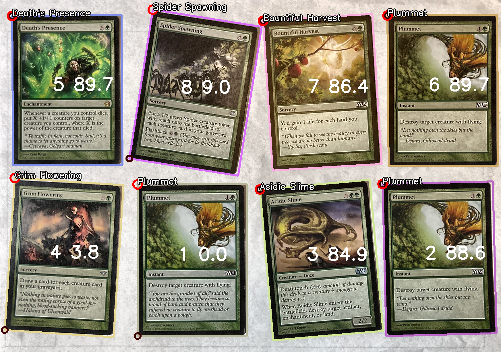
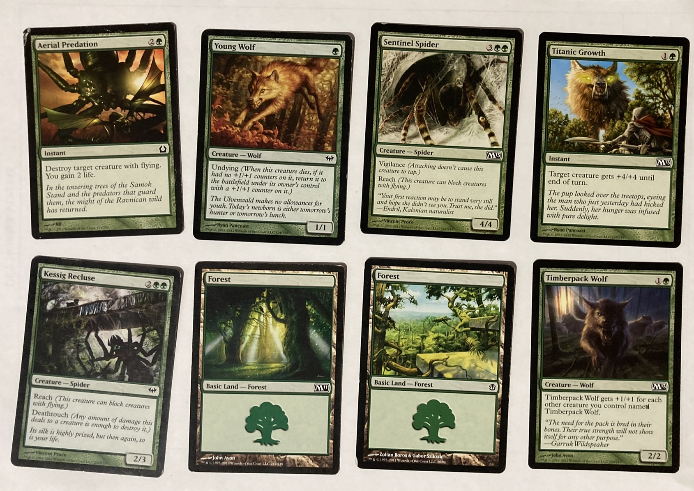
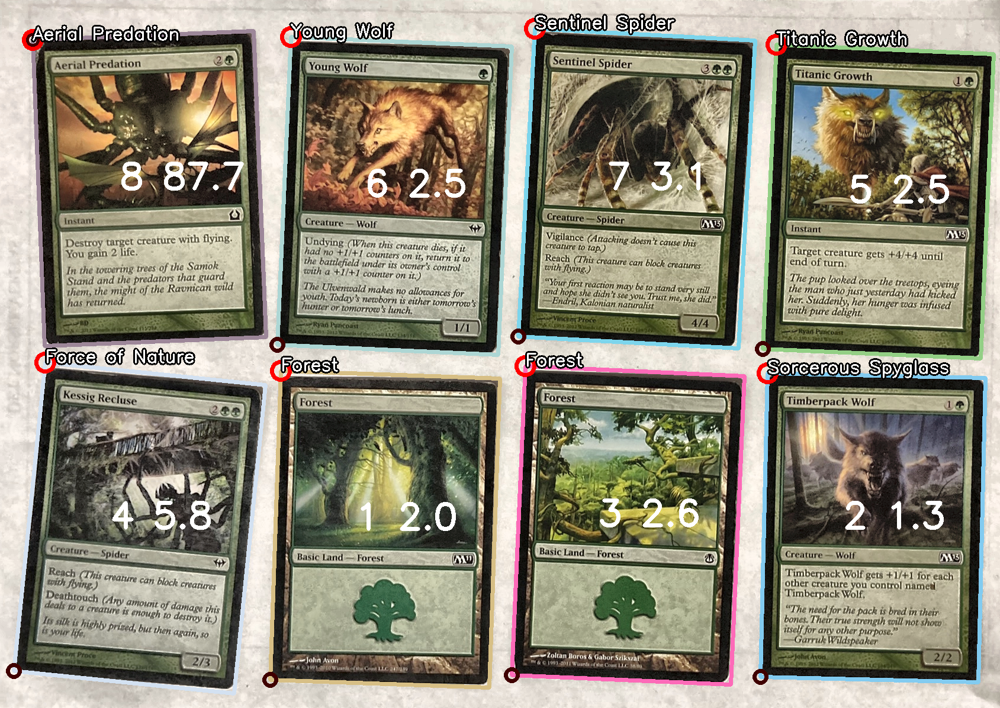
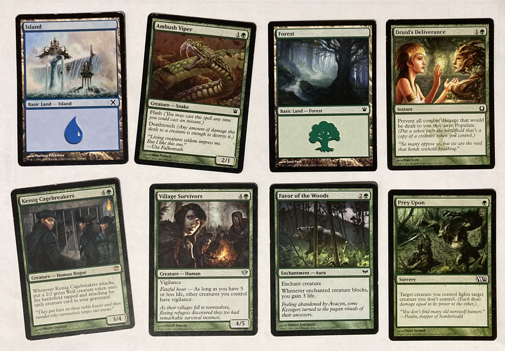
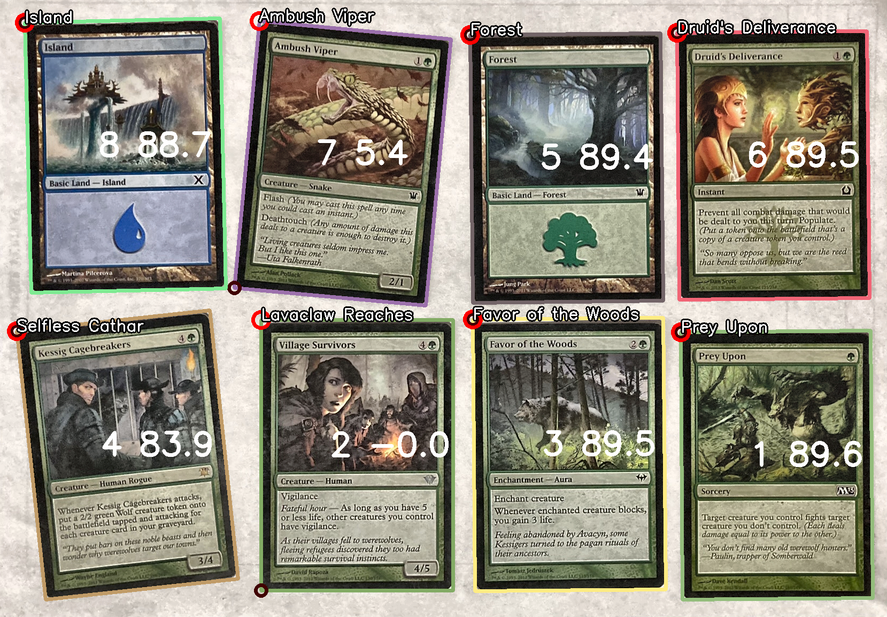

# MTG Scan

Fairly bad attempt at recognizing [Magic The Gathering (MTG)](https://magic.wizards.com/) cards from a given image.

Uses [opencv-python](https://github.com/opencv/opencv-python) and [imagehash](https://github.com/JohannesBuchner/imagehash) (perceptual hashing) to recognize the cards.

I have little to no experience with image processing. This was more of an excuse to use OpenCV for something. I probably won't develop this further.

Real cards and their hashes are collected via [Scryfall's bulk data files](https://scryfall.com/docs/api/bulk-data).

If provided a good picture (e.g. eight MTG cards lay out on a white A4 paper in decent lighting) it will yield some good results (but nowhere remotely close to perfect).

Could probably be improved with:

* Better knowledge of image processing/OpenCV
* By hashing only the card art?

## Example 1

Lucky 8/8

## Example 2

6/8

## Example 3

6/8

